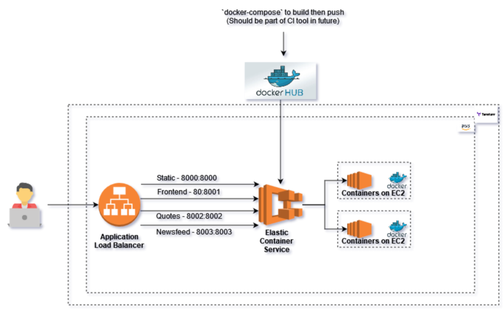
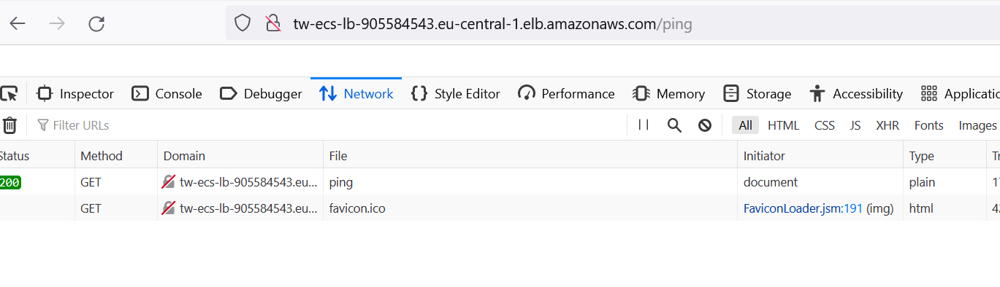

# terraform-app-deploy

## Architecture Diagram

---

## Usage

It is used to host a Clojure application on AWS on a containerised platform. It will create following services

| This includes: |
|------|
| VPC |
| Two each subnet (Public & Private) |
| Internet Gateway |
| NAT Gateway |
| Launch configuration |
| Autoscaling groups |
| ECS - with tasks and services |
| Application load balancer with target groups |
| Secure security groups |
||
||

<!-- markdownlint-disable -->
## Requirements

| Name | Version |
|------|---------|
| terraform | >= 0.12.0 |
| aws | >= 2.0 |

## Inputs

| Name | Description | Type | Default | Required |
|------|-------------|------|---------|:--------:|
| aws | Credentials for this AWS account. | `map(string)` | <pre> {access_key = ""   secret_key = ""   region = "eu-central-1"} </pre>  | yes |
| vpc | IP CIDR details for VPC creation | `map(string)` | <pre>{ vpc_cidr         = "10.0.0.0/16",   subnet_private_1 = "10.0.1.0/24"   subnet_private_2 = "10.0.2.0/24"   subnet_public_1  = "10.0.3.0/24"   subnet_public_2  = "10.0.4.0/24" }</pre> | no |
| container_details | Instance configuration details | `map(string)` | <pre>{frontend_image = "{dockerhub-username}/tw-frontend:v2" frontend_port  = "8001" static_image   = "{dockerhub-username}/tw-static:v2" static_port    = "8000" quotes_image   = "{dockerhub-username}/tw-quotes:v2" quotes_port    = "8002" newsfeed_image = "{dockerhub-username}/tw-newsfeed:v2" newsfeed_port  = "8003"}</pre> | yes |
| custom_tags | Custom tags which can be passed on to the AWS resources. They should be key value pairs having distinct keys. | `map(string)` | <pre>CreatedBy   = "terraform" }</pre> | no |
| cluster_name |The name of AWS ECS cluster. | `string` | `"tw-cluster"` | no |
| instance |Instance configuration details. | `string` | <pre>{asg_min_size  = 2 asg_max_size  = 2 asg_desired_capacity = 2 ecs_task_count  = 2}</pre>  | no |

## Outputs

| Name | Description |
|------|-------------|
| alb_endpoint | ALB endpoint to access web application |

## Steps to build and deploy the application
- run `cd code-build`
- replace `{dockerhub-username}` to your docker hub user name in docker-compose.yaml file.
- run `make image` -> This will build the code and create the image locally
- push all the four images to the docker hub. like `docker push {dockerhub-username}/tw-frontend:v2`.
- run `cd ..`
- set the required variables for terraform mentioned in the Input section.
- run `terraform init`
- run `terraform plan`
- run `terraform apply`
- Once all resources are created successfully and ECS tasks started running. You can check the application using the ALB endpoint.

